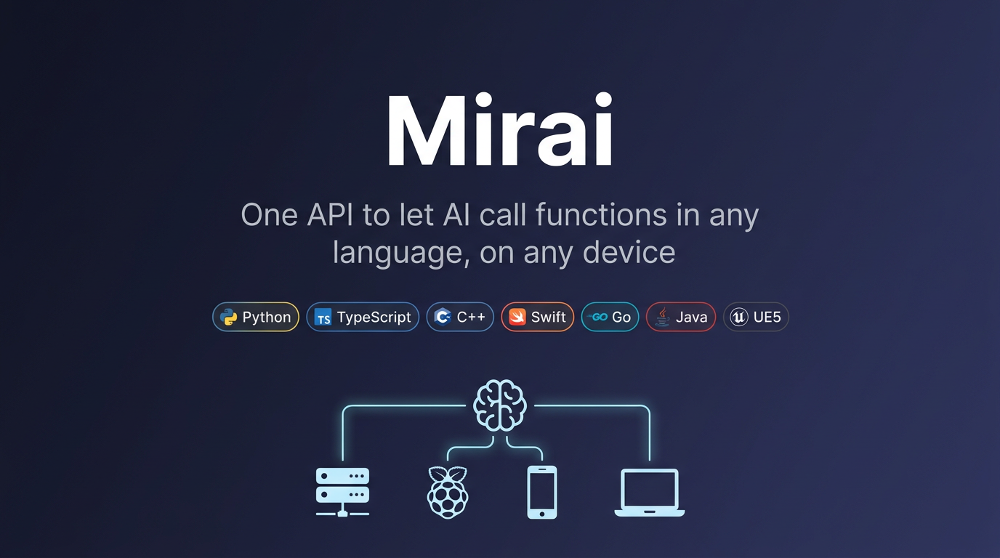
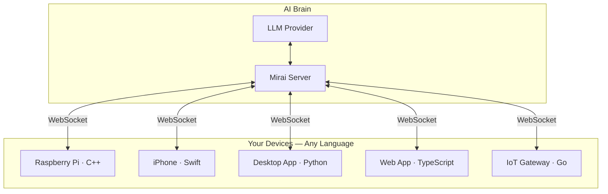

# Mirai

[](https://github.com/wenxijiao/Mirai/actions/workflows/ci.yml)
[](LICENSE)
[](https://www.python.org/downloads/)

**One API to let AI call functions in any language, on any device.**

Register a function. AI calls it. Python, Rust, Kotlin, Dart, C++, Swift, TypeScript, Go, Java, C# — same pattern everywhere.

> Status: alpha. The core workflows are usable today, but APIs, generated templates, and UX may still change as the project stabilizes.



## Quick Start

### 1. Install

When the PyPI package is published:

```bash
pip install mirai-agent
```

From source today:

```bash
git clone https://github.com/wenxijiao/Mirai.git
cd Mirai
pip install .
```

For local development:

```bash
pip install -e ".[dev]"
```

### 2. Start the server

```bash
mirai --server
```

On first run, Mirai walks you through choosing a provider and model (Ollama for local, OpenAI, Gemini, or Claude for cloud).

### 3. Try the demo

```bash
mirai --demo          # launches Smart Home + Planner
mirai --chat          # ask AI to control both windows
```

Keep `mirai --server` running in its own terminal. Start `mirai --demo`, `mirai --chat`, or `mirai --ui` in a second terminal.

### 4. Connect your own app

```bash
cd my_project
mirai --edge --lang python   # or: swift, typescript, cpp, go, java, csharp, rust, kotlin, dart, ue5
```

This scaffolds a `mirai_tools/` directory with SDK code and a setup template. Edit the template, call the init function from your app, and your functions appear as AI tools.

## Demo

`mirai --demo` launches **two independent Python GUI programs** at once:

- **Smart Home** (package `mirai.demo.smart_home`): lights, TV, thermostat, coffee machine, locks, and more (room cards + status text)
- **Planner** (package `mirai.demo.planner`): a tkinter schedule app — mini calendar + day timeline with colored events; tools are add/remove/update/list/clear/reminder style CRUD

The demo requires a graphical desktop session. On Linux, install Tk support first (for example `sudo apt install python3-tk` on Debian/Ubuntu).

Both windows are display-only and show a consistent status line (`Connected · EdgeName · Tools`) so users can immediately see what is connected. Open `mirai --chat` or `mirai --ui` to control both apps in natural language:

> Turn on the kitchen lights and add a "Cook dinner" event at 18:00 for 1 hour, category personal.

More one-line demo prompts:

- `Set thermostat to 22, and show me today's schedule.`
- `Lock the front door, add "Team standup" tomorrow at 10:00 for 30 minutes, category meeting.`
- `Turn off bedroom lamp, remove the "Lunch with Alex" event.`
- `Open garden gate, update "Code review" to start at 15:00 instead.`
- `Brew coffee, set a reminder for "Morning run" 15 minutes before.`
- `Turn off living room TV, clear all planner events, then lock the front door.`

## Same pattern, every language

Typical flow: run **`mirai --edge`** in your project → implement tools **in whatever modules you like** (not in the generated file) → in the generated setup file **import those callables and register them with the agent**, then define `init_mirai` / `initMirai` → call that init function **once from your app entry point** (`main`, `__main__`, or equivalent) while the process keeps running. There is no required folder or filename for implementations; only the imports in setup need to reach your functions. The built-in demos illustrate one layout: e.g. `mirai.demo.smart_home.app` holds tool code, `mirai.demo.smart_home.bootstrap` wires the SDK, and `__main__.py` calls `init_mirai()` then runs the GUI.

### Python

```bash
mirai --edge --lang python
```

Implement tools in any package or module you prefer. The generated **`mirai_tools/python/mirai_setup.py`** should import the callables you want exposed, register them, and expose `init_mirai` — the demos use an `app` + `setup` split only as a **convention**, not a requirement.

Example: `my_app/tools.py` (could equally be `my_app/services/foo.py`, `src/domain/handlers.py`, etc.):

```python
def analyze_data(path: str) -> str:
    """Load a CSV and return a short summary.

    Args:
        path: Path to the CSV file on disk.
    """
    # your implementation
    return "summary"
```

`mirai_tools/python/mirai_setup.py` — import, register, start the background client:

```python
from my_app.tools import analyze_data

from .mirai_sdk import MiraiAgent


def init_mirai():
    agent = MiraiAgent(edge_name="My Server")
    agent.register(analyze_data, "Analyze CSV at path and return a short summary")
    agent.run_in_background()
    return agent
```

App entrypoint — call `init_mirai()` once, then run the rest of your program (compare `mirai.demo.smart_home.__main__` / `mirai.demo.planner.__main__`):

```python
from mirai_tools.python.mirai_setup import init_mirai

agent = init_mirai()
# … build UI or long-running work; call agent.stop() on shutdown if you keep the reference …
```

If you embed Mirai inside an already-installed Python package, you can also use `from mirai.sdk import MiraiAgent` directly without the `mirai_tools/` tree — same `register` / `run_in_background` calls.

### TypeScript

```bash
mirai --edge --lang typescript
```

`mirai_tools/typescript/miraiSetup.ts` — import handlers from any module you choose, register tools, then export `initMirai`:

```typescript
import { MiraiAgent } from "./mirai_sdk/src";
import { searchProducts } from "../src/catalog"; // example path — use your own layout

export function initMirai() {
  const agent = new MiraiAgent({ edgeName: "My Web App" });
  agent.register({
    name: "searchProducts",
    description: "Search the product catalog",
    handler: async (args) => searchProducts(args.string("query") ?? ""),
  });
  agent.runInBackground();
  return agent;
}
```

App entry:

```typescript
import { initMirai } from "./mirai_tools/typescript/miraiSetup";

initMirai();
// … rest of your app …
```

<details>
<summary><strong>C++, Swift, Go, Java, C#, UE5</strong></summary>

**C++** (`mirai_tools/cpp/…`, after `mirai --edge --lang cpp`)

```cpp
#include <mirai/mirai_agent.hpp>

mirai::MiraiAgent agent("mirai-lan_...", "My Raspberry Pi");
agent.registerTool({
    .name = "read_sensor",
    .description = "Read temperature from GPIO sensor",
    .handler = [](auto args) { return readSensor(); }
});
agent.runInBackground();
```

**Swift** (`mirai_tools/swift/…`, after `mirai --edge --lang swift`)

```swift
import MiraiSDK

let agent = MiraiAgent(edgeName: "My iPhone")
agent.register(
    name: "take_photo",
    description: "Take a photo with the camera"
) { args in
    return try await takePhoto()
}
agent.runInBackground()
```

**Go** (`mirai_tools/go/…`, after `mirai --edge --lang go`)

```go
agent := mirai_sdk.NewAgent(mirai_sdk.AgentOptions{
    EdgeName: "My Go Service",
})
agent.Register(mirai_sdk.RegisterOptions{
    Name:        "get_status",
    Description: "Get system health status",
    Handler:     func(args mirai_sdk.ToolArguments) (string, error) { return getStatus() },
})
agent.RunInBackground()
```

**Java** (`mirai_tools/java/…`, after `mirai --edge --lang java`)

```java
var agent = new MiraiAgent("mirai-lan_...", "My Java App");
agent.register(new RegisterOptions()
    .name("lookup_user")
    .description("Look up a user by ID")
    .handler(args -> lookupUser(args.getString("id", ""))));
agent.runInBackground();
```

**C#** (`mirai_tools/csharp/…`, after `mirai --edge --lang csharp`)

```csharp
var agent = new MiraiAgent("mirai-lan_...", "My C# App");
agent.Register(new RegisterOptions()
    .SetName("lookup_user")
    .SetDescription("Look up a user by ID")
    .SetHandler(args => LookupUser(args.GetString("id"))));
agent.RunInBackground();
```

**UE5** — native module under `mirai_tools/ue5/`; call the generated `InitMirai` / `FMiraiAgent` pattern from your game module (see `mirai --edge --lang ue5` template).

</details>

## How It Works



Your app connects to the Mirai server over WebSocket and registers functions as tools. The LLM sees them alongside server-side tools and calls whichever it needs. Results flow back through the same connection.

## Main Commands

| Command | What it does |
|---|---|
| `mirai --server` | Start the backend API server |
| `mirai --server --telegram` | Start the API and a [Telegram bot](#telegram-optional) together (same machine) |
| `mirai --telegram` | Run only the Telegram bot; connects to the API like `mirai --chat` (LAN / relay) |
| `mirai --server --line` | Start the API and a [LINE webhook](#line-optional) sidecar (default port 8788) |
| `mirai --line` | Run only the LINE webhook server; core API must already be reachable |
| `mirai --ui` | Start the web UI (chat, tools, settings) |
| `mirai --chat` | Start terminal chat |
| `mirai --edge` | Scaffold an edge workspace in the current directory |
| `mirai --demo` | Run the Smart Home + Planner (schedule) demo |
| `mirai --cleanup` | Delete all Mirai user data (`~/.mirai/`) |
| `mirai --cleanup-memory` | Delete saved chat memory and embeddings only |
| `mirai --setup` | Reconfigure models and providers |

## Telegram (optional)

Chat with Mirai from **Telegram**: the bot forwards messages to your Mirai server’s `POST /chat` endpoint (same protocol as `mirai --chat`). Dependencies are included in the default `pip install`; no extra extras.

### 1. Create a bot and obtain a token

1. In Telegram, open [**@BotFather**](https://t.me/BotFather).
2. Send `/newbot`, choose a name and a username (must end with `bot`).
3. Copy the **HTTP API token** BotFather gives you (keep it secret).

### 2. Configure the token (choose one)

| Method | What to do |
|--------|------------|
| **Environment variable** | `export TELEGRAM_BOT_TOKEN='your_token_here'` (Unix) or set it in the system / service environment on Windows. |
| **Config file** | Add `"telegram_bot_token": "your_token_here"` under `~/.mirai/config.json` (same folder as other Mirai settings). |
| **Interactive prompt** | Run `mirai --server --telegram` or `mirai --telegram` **without** the variable set in the environment: Mirai will ask you to paste the token and **saves it** to `~/.mirai/config.json` (press Enter to exit without saving). |

Environment variable **overrides** the file if both are set.

### 3. How to run

- **`mirai --server --telegram`** (recommended for a single machine)  
  Starts the HTTP API (`127.0.0.1:8000`) **and** the Telegram bot in one terminal. The CLI injects the token into the API process so features like **timers** can push follow-up messages to Telegram without a separate client.

- **`mirai --telegram` only**  
  Runs **only** the Telegram bot. It connects to Mirai the same way as `mirai --chat` (saved LAN code, pasted code, or relay profile). Use this when the API runs on another host; you must put the **same bot token** on the **machine that runs `mirai --server`** if you want timer-based pushes to Telegram.

### 4. Optional: restrict who can use the bot

- Set **`TELEGRAM_ALLOWED_USER_IDS`** to a comma-separated list of numeric Telegram user IDs, **or**
- Add **`telegram_allowed_user_ids`** (array of integers) in `~/.mirai/config.json`.

If unset / empty, **any** user who finds the bot can talk to it (still subject to Telegram’s normal bot rules).

### 5. Behaviour notes

- **Tool confirmation**: Some tools may ask for **Allow / Deny / Always allow** via inline buttons before running.
- **Sessions**: Each Telegram user gets a separate Mirai session id (`tg_<user_id>`).
- **System prompt**: `/system` changes the **session** system prompt for that user only (via `GET/PUT/DELETE /config/session-prompt`), not the server-wide default.
- **Timers and delayed actions**: The model must call tools such as `set_timer` / `schedule_task`; the API server that runs the timer needs the bot token to call Telegram’s `sendMessage` for notifications.

For the full variable list (logging, HTTP noise, relay caveats), see **[Configuration — Telegram](docs/CONFIGURATION.md#telegram)**.

## LINE (optional)

Chat from **LINE** via the Messaging API: Mirai exposes `POST /line/webhook`, verifies `X-Line-Signature`, and forwards chat to the same `POST /chat` NDJSON flow as Telegram. Tool confirmations use **Flex** messages with postback buttons.

### Credentials

| Method | What to do |
|--------|------------|
| **Environment** | `LINE_CHANNEL_SECRET` and `LINE_CHANNEL_ACCESS_TOKEN` from the LINE Developers Console. |
| **Config file** | `line_channel_secret` and `line_channel_access_token` in `~/.mirai/config.json`. |
| **Interactive** | `mirai --server --line` or `mirai --line` will prompt for both if missing (and save to the config file). |

### How to run

- **`mirai --server --line`** — Starts the HTTP API and a small webhook server on **`LINE_BOT_PORT`** (default **8788**). Set the LINE channel webhook URL to `https://<your-host>:8788/line/webhook` (TLS required in production).
- **`MIRAI_LINE_INCORE=1`** — Mount `POST /line/webhook` on the **same** FastAPI app as the core API (single port); still configure `LINE_CHANNEL_SECRET` / access token on the API process for timer pushes.
- **`mirai --line` only** — Webhook sidecar only; point `MIRAI_SERVER_URL` at your core API (same idea as `mirai --telegram`).

Sessions are keyed by `line_<user_id>`; `/clear`, `/model`, and `/system` work the same as Telegram. `LINE_DISABLE_PUSH=1` can suppress outbound push messages while testing.

## Supported Providers

| Provider | Chat | Embedding | Notes |
|---|---|---|---|
| Ollama | Yes | Yes | Local models, no API key needed |
| OpenAI | Yes | Yes | Also works with OpenAI-compatible endpoints |
| Gemini | Yes | Yes | Google Gemini |
| Claude | Yes | No | Anthropic Claude (use another provider for embeddings) |

You can mix providers — for example OpenAI for chat and Ollama for embeddings.

## Edge SDKs

| Language | Runtime | Install |
|---|---|---|
| Python | `websockets` | `pip install .` or `mirai --edge --lang python` |
| TypeScript | `ws` (Node) / native (browser) | `npm install mirai-sdk` or `mirai --edge --lang typescript` |
| C++ | CMake, IXWebSocket | `mirai --edge --lang cpp` |
| Swift | SwiftPM | `mirai --edge --lang swift` |
| Go | `gorilla/websocket` | `mirai --edge --lang go` |
| Java | JDK 11+ native WebSocket | `mirai --edge --lang java` |
| C# | .NET 6+ native WebSocket | `mirai --edge --lang csharp` |
| Rust | Tokio + `tokio-tungstenite` | `mirai --edge --lang rust` |
| Kotlin | OkHttp (JVM) | `mirai --edge --lang kotlin` |
| Dart | `web_socket_channel` (VM / Flutter) | `mirai --edge --lang dart` |
| UE5 | Unreal Engine module | `mirai --edge --lang ue5` |

See the [SDK overview](mirai/sdk/README.md) for per-language details and full examples.

## Documentation

| Document | Description |
|---|---|
| [Getting Started](docs/GETTING_STARTED.md) | Installation, first run, providers, UI, and terminal chat |
| [Edge Tools Guide](docs/EDGE_TOOLS.md) | How to connect your app, device, or game as an edge tool host |
| [Configuration](docs/CONFIGURATION.md) | Environment variables, connection codes, **Telegram**, deployment, Docker |
| [Architecture](docs/ARCHITECTURE.md) | System design, API stability, admin endpoints |
| [HTTP API](docs/HTTP_API.md) | Chat NDJSON stream, curl examples |
| [Memory](docs/MEMORY.md) | Session history and LanceDB embeddings |
| [Testing](docs/TESTING.md) | Running and writing tests |

Prefer containers? See [Configuration](docs/CONFIGURATION.md) for Docker and deployment notes.

## How Mirai Differs

Mirai is **not** another Python-only LLM chaining library. It ships a runnable server, terminal UI, and web UI, plus **first-class edge tool hosts** across eleven languages. The focus is on **device-side tool execution**: your game, phone app, IoT sensor, or desktop program exposes functions, and the AI calls them directly in your process.

## OSS vs. Enterprise

This package (`mirai-agent`) is the **open-source single-user / LAN core**. It runs locally or on your home network, has no Bearer auth, no per-tenant scoping, and no quotas. Everything you need to chat with an agent and register tools across languages is here.

A separate **`mirai-enterprise`** package extends this core via the `mirai.core.plugins` port system (`IdentityProvider`, `QuotaPolicy`, `BotPool`, `MemoryFactory`, `SessionScope`, `EdgeScope`, `AuditSink`, `BillingHook`, `RouteExtender`, `MiddlewareExtender`) to add multi-tenant identity, per-user encryption, billing/usage metering, an admin API, the public **relay** for remote pairing, and PostgreSQL-backed storage. The enterprise package depends on this OSS package, registers itself via Python `entry_points` (group `mirai.plugins`), and ships its own CLI (`mirai-enterprise serve`). It is distributed privately (private Git / Docker registry) and is not on PyPI.

If you only need a personal or LAN agent, you do **not** need the enterprise package — `pip install mirai-agent` is everything. When you do need multi-tenant identity, billing, relay, or PostgreSQL-backed storage, see the dedicated [Upgrading to Enterprise](docs/UPGRADING_TO_ENTERPRISE.md) guide for the install, migration, and runtime steps.

## License

Apache License 2.0 — see [LICENSE](LICENSE) and [NOTICE](NOTICE).

[Contributing](CONTRIBUTING.md) · [Security](SECURITY.md) · [Changelog](CHANGELOG.md) · [Commercial](COMMERCIAL.md) · [Code of Conduct](CODE_OF_CONDUCT.md)
