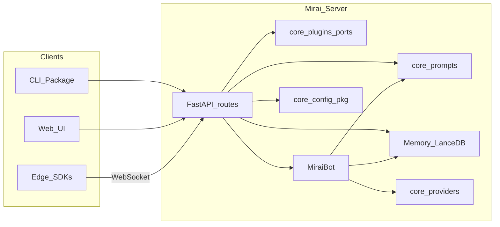

# Architecture

## Overview

Internal layout (Python): `mirai/core/prompts/` (defaults, persisted prompts, `compose_messages`), `mirai/core/config/` (paths, `ModelConfig`, store, credentials, setup wizard), `mirai/core/memories/` (`Memory`, constants, tool replay, embedding state), `mirai/core/streaming/` (reasoning tag parser), `mirai/core/api/http_helpers.py` for HTTP helpers, `mirai/core/plugins/` for the extension port layer (identity, quota, billing, session scope, bot pool, memory factory, edge scope, audit, route extender, middleware extender), `mirai/tools/bootstrap.py` to register local tools (`init_mirai`).

## Server-Side Tools

Server-side tools are Python functions decorated with `@mirai_tool` in `mirai/tools/`. They are loaded at startup via `load_tools_from_directory()` and stored in `TOOL_REGISTRY`. SDK wiring for your project typically lives in a `bootstrap` module (e.g. `mirai/tools/bootstrap.py`) that calls `init_mirai()`.

## Edge Tools

Edge tools are registered by remote clients over WebSocket at `/ws/edge`. Each client sends a `register` message with tool schemas on connect. The server prefixes tool names with the edge name and stores them in `EDGE_TOOLS_REGISTRY`.

Core server tools are loaded into every model request when enabled. Edge tools are routed dynamically: for each chat turn, Mirai builds retrieval documents from the Edge name, aliases, tool name, description, and parameter descriptions, embeds them with the configured embedding model, and sends only the most relevant Edge tool schemas to the provider (default: 20). This keeps the model-facing tool set small even when many Edge processes register hundreds of functions.

When the LLM selects an edge tool, the server sends a `tool_call` message to the relevant client. The client executes the function and returns a `tool_result`.

## Admin API

Mirai exposes a local admin API for configuration, tools, and memory.

| Method | Endpoint | Purpose |
|---|---|---|
| `GET` | `/config/model` | Read current model config |
| `PUT` | `/config/model` | Update provider/model |
| `GET` | `/tools` | List server and edge tools |
| `POST` | `/tools/toggle` | Enable or disable a tool |
| `GET` | `/memory/search` | Search memory |
| `GET` | `/tenancy/me` | Multi-tenant: user, tenant label, daily chat quota; single-user: mode only |
| `GET` | `/tenancy/audit` | Multi-tenant: recent audit rows for the current user |

For HTTP details (chat NDJSON stream, Relay `/v1/*` mapping, curl examples), see [HTTP_API.md](HTTP_API.md).

## Public API Stability

Mirai is in the **0.x** stage. The interfaces intended for users to build on are:

- The `mirai` CLI
- The documented HTTP routes in [HTTP_API.md](HTTP_API.md)
- The SDKs and templates under [`mirai/sdk/`](../mirai/sdk/README.md) and `mirai --edge`

Internal Python modules such as `mirai.core.*` and `mirai.tools.*` are implementation details and may change between releases. Breaking changes to user-facing surfaces are called out in the changelog and release notes.

## How Mirai Differs

Mirai is **local-first**: it ships a runnable server, terminal UI, and Reflex web UI, plus **first-class edge tool hosts** (multi-language SDKs) so your game, app, or device can expose tools from its own process. It is not only a Python library for chaining LLM calls; the focus is on **operable defaults** and **device-side** tool execution.

For remote access, users typically pair the server with Tailscale or similar. An optional **Relay** mode exists for pairing flows. See [HTTP_API.md](HTTP_API.md).
